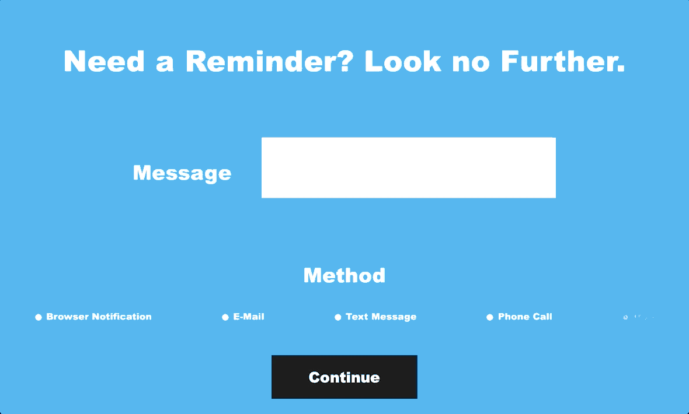

# RemindMe
 
 As humans, we all need reminders for a various number of things from time to time. Most of the time, a simple sticky note, or a note on ones calendar, whether it be physical or didgital, is more than good enough. However, there are times when more is needed. 

 What if you could set up a reminder in the form of an e-mail or text message sent right to your phone? Not enough? Maybe you would like an actual phone call, or even a physical peice of mail, to remind you of that special day that is around the corner. This is exactly what the RemindMe service hopes to achieve. 

 The main page is where users set the reminder they want to recieve by entering their message, and the method to which they would like to recive the reminder. Right now, all methods except physical mail are functional.

 After configuration on the first page, the user is then taken to their respective section based on which method they chose. For the browser notification, they are simply prompted to enter how long until they want their reminder (in minutes). The rest of the sections are similar, with the page prompting the user for the needed contact information, only this time the reminder is scheduled on a calendar interface, allowing for both short and long-term reminders.

 Here is what setting up a browser notification would look like:
 

 Setting up an email, SMS, or phone call reminder are all similar to each other. Here is the email reminder setup as an example:
 

 

 The following Javascript and CSS libraries were used:
 Odometer (Browser notification countdown effect) - [Library](https://github.hubspot.com/odometer/)
 Flatpickr (Calendar interface for scheduling) - [Library](https://github.com/flatpickr/flatpickr)

 That is currently the extent of this project. I tried to keep it simple and intuitive. To try it for yourself, click here - https://jaylens-remindme.herokuapp.com (NOTE: The schedule feature does not currently work on deployment. This causes any reminder set to be sent instantly. This is being looked into and will be fixed shortly)

 As there is no verification features yet, I ask that you please only use this service for setting reminders for yourself. Do not attempt to try and scam and/or harass anybody with this service. 
